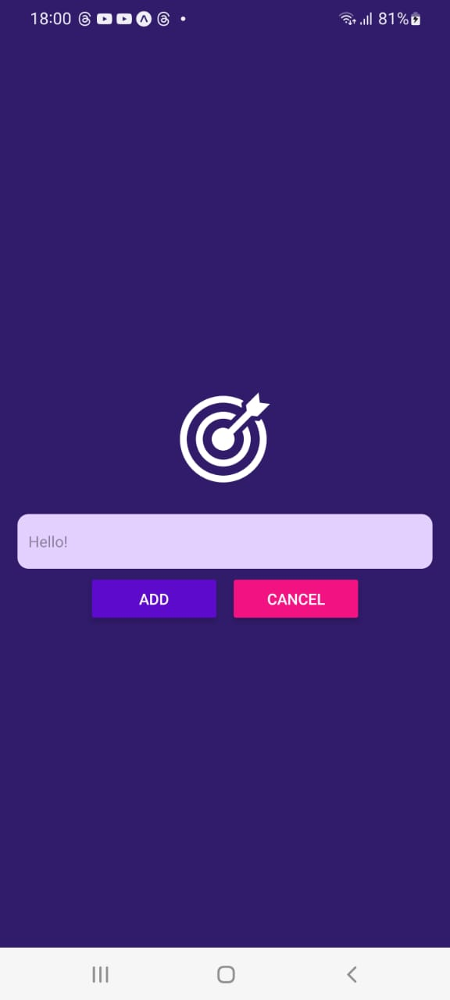
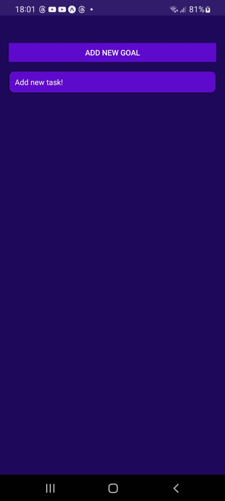

# Aplicación de Tareas (New task)

Esta es una aplicación sencilla de tareas (to-do) que permite a los usuarios agregar nuevos objetivos y ver las tareas pendientes.

## Características

- Agregar nuevos objetivos o metas.
- Visualizar la lista de tareas pendientes.

## Capturas de Pantalla

Aquí hay algunas capturas de pantalla de la aplicación:

*Vista de la aplicación al agregar una nueva tarea.*

*Vista de la lista de tareas pendientes.*

## Cómo Usar

Para usar la aplicación, sigue estos pasos:

1. Abre la aplicación.
2. Haz clic en el botón "Agregar Nuevo Objetivo" para añadir una tarea.
3. Visualiza tus tareas pendientes en la pantalla principal.

## Contribuciones

Las contribuciones son bienvenidas. Si tienes alguna sugerencia o corrección, no dudes en abrir un issue o un pull request.

## Licencia

[MIT](LICENSE)
